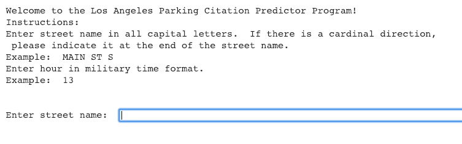

# Los Angeles Parking Citations:  A Machine Learning Analysis
Using data from Los Angeles Parking Citations (source:  Kaggle) for ML analysis, this project will determine high risk parking areas by assessing citation volume based on time of day and utilizing pattern recognition on violation types.  

This project will allow new predictions such that users can enter in the street name and hour to generate a low/risk parking warnings.

#  About the Data Frame
* Data set size:  232 MB
* Data set format:  .csv, .json
* Update Frequency:  Daily
* Data Entries (as of Nov. 1, 2018): 8,359,441 
* Data fields:  Ticket Number, Issue Date, Issue time, Meter ID, Marked Time, RP State Plate, Plate Expiry Date, VIN, Make, Body Style, Color, Location, Route, Agency, Violation Code, Violation Description, Fine Amount, Latitude, Longitude

#  Files
There are three total files: 
*  two files dedicated to data cleaning (DataCleanUp.ipynb, DataCleanUp_2_Encoding)
*  one file dedicated to the machine learning algorithms and evaluation (MLproject.ipynb)

#  How to Run
* **To access data files,** use Google's Colab notebooks and log in with a google CSUF account. Only CSUF google users are 
permitted to access these data files.  If you are a non-CSUF google user, please reach out to me 
directly and I will email you the files.

* **Environment:** It is recommended that you run the .ipynb files on Google Colab or Jupyter.  

**Steps:**

1.  Log into your google CSUF account.  Only CSUF google users are permitted to access the data files.  If you are a non-CSUF google user, please reach out to me and I will email you the data files.

2.  Open a Google Colab or Jupyter notebook.  (Google Colab notebook is recommended).

3.  Open 'MLproject.ipynb' in Google Colab notebook and select 'Runtime' --> 'Run All'

4.  Authenticate Google Account for GDrive access to the data files.

5.  Wait 5 minutes for data load and machine learning algorithms to run.

6.  Input street name and hour to predict the risk of recieving a parking citation in Los Angeles.

#  User Interface
**After step 5, the following interface will appear for user entries.**

